# **Projeto ponta a ponta de análise de dados de empresa de turismo sustentável**

### Resumo

Esse projeto analisou dados de reservas, clientes, ofertas e práticas sustentáveis da empresa EcoViagens, cujo foco é oferecer experiências de turismo sustentável aos seus clientes. O projeto teve abordagem ponta a ponta, passando pela criação do banco de dados com foco em permitir o acompanhamento das demandas gerenciais da empresa, proposição de métricas estratégicas a partir dos dados modelados e, por fim, a análise dos dados e disponibilização por meio de dashboards gerenciais. Os principais produtos obtidos em cada etapa foram:

- Modelagem de dados da plataforma da EcoViagens:
    
    Essa etapa resultou num Diagrama Entidade-Relacionamento descrevendo a estrutura das tabelas que compõe a base de dados e um [script Python](src/pipeline.py) para carga automática dos dados em banco de dados PostgreSQL.
    
- Proposição de KPIs estratégicos que permitissem avaliar o desempenho do negócio, entender o comportamento dos clientes e guiar melhorias dos serviços:
    
    Essa etapa resultou num descritivo contendo os KPIs, sua importância para o negócio e o método de cálculo.
    
- Análise de dados via SQL para mapear o desempenho da empresa em termos de receita, fidelização de clientes, avaliações e popularidade de práticas sustentáveis.
    
    Essa etapa resultou em insights para os times de negócio, marketing e experiência do cliente, além da documentação das consultas por meio de um [script SQL](sql_scrips/perguntas_negocio.sql) contendo o objetivo e metodologia de cada consulta.
    
- Elaboração de dashboards de acompanhamento dos KPIs propostos na etapa 2.
    
    Essa etapa resultou em um [relatório em Power BI](https://app.powerbi.com/view?r=eyJrIjoiYjAwMzUxOGQtYzgxMS00NDU3LTk1M2QtYjY4YTUxYmUyMTY0IiwidCI6ImUyZjc3ZDAwLTAxNjMtNGNmNi05MmIwLTQ4NGJhZmY5ZGY3ZCJ9) e uma [apresentação executiva](https://www.canva.com/design/DAHBt1sDoSc/tuKTbycc5F7xqb_LT2LkGQ/edit?utm_content=DAHBt1sDoSc&utm_campaign=designshare&utm_medium=link2&utm_source=sharebutton) com os principais achados. Os resultados da análise dos dados indicaram: comportamento instável da receita, baixa taxa de fidelização de clientes, ausência de retorno financeiro ao fidelizar clientes e não-percepção de valor nas práticas sustentáveis por parte dos clientes. Assim, foram feitas recomendações visando o aumento da previsibilidade da receita, do ticket médio e da percepção de valor em relação às ofertas e sustentabilidade.
    

Leia mais sobre o projeto abaixo.

### Índice

- [1. Contexto](https://github.com/luisamuzzi/projeto_ecoviagens?tab=readme-ov-file#1-contexto)
- [2. Premissas assumidas para a análise](https://github.com/luisamuzzi/projeto_ecoviagens?tab=readme-ov-file#2-premissas-assumidas-para-a-an%C3%A1lise)
- [3. Ferramentas utilizadas](https://github.com/luisamuzzi/pro-jeto_ecoviagens?tab=readme-ov-file#3-ferramentas-utilizadas)
- [4. Estratégia de solução](https://github.com/luisamuzzi/projeto_ecoviagens?tab=readme-ov-file#4-estrat%C3%A9gia-de-solu%C3%A7%C3%A3o)
- [5. O produto final do projeto](https://github.com/luisamuzzi/projeto_ecoviagens?tab=readme-ov-file#5-o-produto-final-do-projeto)
- [6. Principais insights de dados](https://github.com/luisamuzzi/projeto_ecoviagens?tab=readme-ov-file#6-principais-insights-de-dados)
- [7. Conclusão](https://github.com/luisamuzzi/projeto_ecoviagens?tab=readme-ov-file#7-conclus%C3%A3o)
- [8. Próximos passos](https://github.com/luisamuzzi/projeto_ecoviagens?tab=readme-ov-file#8-pr%C3%B3ximos-passos)
- [9. Referências](https://github.com/luisamuzzi/projeto_ecoviagens?tab=readme-ov-file#9-refer%C3%AAncias)

### 1. Contexto

A empresa EcoViagens surgiu com a missão de oferecer serviços de marketplace para conectar operadores turísticos e viajantes interessados na prática de turismo sustentável e de baixo impacto ambiental. Em um primeiro momento, a EcoViagens realizou o lançamento de sua plataforma online de reservas de pacotes e atividades turísticas. Para isso, foi necessário criar um modelo de dados capaz de atender às demandas operacionais da empresa, bem como servir de suporte para decisões baseadas em dados. Com isso, o modelo foi pensado para permitir a realização de análises e a criação de métricas e indicadores para o acompanhamento da saúde do negócio, do desempenho dos operadores e da popularidade de ofertas.

Em seguida, as informações coletadas e armazenadas no banco de dados (reservas, clientes, avaliações, ofertas, atividades, hospedagem e práticas sustentáveis) foram analisadas por meio de SQL e disponibilizadas de forma visual em dashboards no Power BI. Além disso, as principais conclusões e recomendações obtidas da análise foram descritas em uma apresentação executiva.

Esse projeto, portanto, percorreu quatro etapas: modelagem e armazenamento dos dados em banco de dados → proposta de KPIs que devem ser monitorados a partir dos dados → análise dos dados para obtenção de informações estratégicas ao negócio → disponibilização das métricas e insights obtidos por meio de dashboards e uma apresentação executiva.

### 2. Premissas assumidas para a análise

1. Os dados abrangem reservas realizadas no período de junho de 2024 a junho de 2025, estando o mês de junho/2025 incompleto (dados até 08/06/25).
2. Análises temporais utilizam a data de realização da reserva como referência.
3. Análises financeiras consideram apenas reservas concluídas.

### 3. Ferramentas utilizadas

- Python e SQL para a criação do script que automatiza a carga de dados no banco de dados:
    - `psycopg2`
    - `csv`
    - `os`
    - `dotenv`
    - `pathlib`
    - `schedule`
    - `datetime`
- SQL para consultas.
- PostgreSQL como SGDB.
- Power BI como ferramenta de DataViz
- Canva para apresentação executiva.

### 4. Estratégia de solução

1. **Modelagem de dados:**
    
    Nessa etapa, foi estruturado o modelo de dados contendo as entidades necessárias (tabelas), seus atributos (colunas) e as relações/conexões entre elas. Os principais produtos da primeira etapa foram um Diagrama Entidade-Relacionamento (DER) e um descritivo detalhado das entidades e seus respectivos atributos e tipos de dados.
    
    A definição de um modelo de dados robusto é fundamental para garantir a consistência e eficiência do banco de dados, além de permitir a sua escalabilidade e ser a base para a definição de métricas e KPIs estratégicos.
    
    O modelo de dados proposto:

    
    
    Detalhamento das entidades:
    
    - Clientes:
    
    | **Campo** | **Tipo** | **Descrição** |
    | --- | --- | --- |
    | id_cliente | INT (PK) | Identificador único do cliente |
    | nome | VARCHAR | Nome completo do clinte |
    | email | VARCHAR | E-mail do cliente |
    | data_nascimento | DATE | Data de nascimento do cliente |
    | genero | VARCHAR | Gênero do cliente (Masculino, Feminino) |
    | localidade | VARCHAR | Local de residência do cliente |
    - Reservas:
    
    | **Campo** | **Tipo** | **Descrição** |
    | --- | --- | --- |
    | id_reserva | INT (PK) | Identificador único da reserva |
    | id_cliente | INT (FK) | Chave estrangeira → Clientes |
    | id_oferta | INT (FK) | Chave estrangeira → Ofertas |
    | data_reserva | DATE | Data em que a reserva foi feita |
    | data_experiencia | DATE | Data prevista para a experiência |
    | qtd_pessoas | INT | Quantidade de pessoas na reserva |
    | status | VARCHAR | Status da reserva (confirmada, cancelada, concluída) |
    - Avaliações:
    
    | **Campo** | **Tipo** | **Descrição** |
    | --- | --- | --- |
    | id_avaliacao | INT (PK) | Identificador único da avaliação |
    | id_cliente | INT (FK) | Chave estrangeira → Clientes |
    | id_oferta | INT (FK) | Chave estrangeira → Ofertas |
    | nota | INT | Nota dada pelo cliente para a oferta (1 a 5) |
    | comentario | TEXT | Comentário da avaliação (Opcional) |
    | data_avaliacao | DATE | Data da realização da avaliação |
    - Ofertas:
    
    | **Campo** | **Tipo** | **Descrição** |
    | --- | --- | --- |
    | id_oferta | INT (PK) | Identificador único da oferta |
    | tipo_oferta | VARCHAR | Tipo da oferta (Atividade ou Hospedagem) |
    | titulo | VARCHAR | Nome da oferta |
    | descricao | TEXT | Descrição da oferta |
    | preco | DECIMAL (10, 2) | Preço unitário da oferta |
    | id_operador | INT (FK) | Chave estrangeira → Operadores |
    - Operadores:
    
    | **Campo** | **Tipo** | **Descrição** |
    | --- | --- | --- |
    | id_operador | INT (PK) | Identificador único do operador |
    | nome_fantasia | VARCHAR | Nome do operador |
    | cnpj | VARCHAR | CNPJ do operador |
    | telefone | VARCHAR | Telefone do operador |
    | email | VARCHAR | E-mail do operador |
    | localidade | VARHCAR | Localização do operador |
    - Hospedagem (subtipo de Oferta; relação de herança):
    
    | **Campo** | **Tipo** | **Descrição** |
    | --- | --- | --- |
    | id_oferta | INT (PK, FK) | Chave estrangeira → Oferta |
    | tipo_acomodacao | VARCHAR | Tipo de acomodação |
    | capacidade | INT | Quantidade máxima de pessoas permitidas na acomodação |
    | possui_cafe_manha | BOOL | Se possui café da manhã (Sim ou Não) |
    - Atividades (subtipo de Oferta; relação de herança):
    
    | **Campo** | **Tipo** | **Descrição** |
    | --- | --- | --- |
    | id_oferta | INT (PK, FK) | Chave estrangeira → Oferta |
    | nivel_dificuldade | VARCHAR | Nível de dificuldade da atividade (fácil, médio ou difícil) |
    | duracao | INT | Tempo de duração da atividade |
    | grupo_maximo | INT | Quantidade máxima de pessoas permitidas na atividade |
    - Oferta/Prática (tabela associativa para “resolver” a relação N:N entre as ofertas e atividades):
    
    | **Campo** | **Tipo** | **Descrição** |
    | --- | --- | --- |
    | id_oferta | INT (FK) | Chave estrangeira → Oferta |
    | id_pratica | INT (FK) | Chave estrangeira → Prática sustentável |
    - Práticas sustentáveis:
    
    | **Campo** | **Tipo** | **Descrição** |
    | --- | --- | --- |
    | id_pratica | INT (PK) | Identificador único da prática sustentável |
    | nome | VARCHAR | Nome/descrição da prática sustentável |
    
    Com base no modelo, os dados coletados pela plataforma foram armazenados em banco de dados PostgreSQL por meio de um script Python. O script automatizou a inserção dos dados no banco, realizando a carga todos os dias a 1h da manhã, permitindo a disponibilização de informações atualizadas para utilização em consultas ou dashboards. Para tanto, foram usadas as bibliotecas: 
    
    - `psycopg2`: usada para interagir com o banco de dados PostgreSQL.
    - `csv`: usada para ler os arquivos com os dados.
    - `os`: usada para obter os valores das variáveis de ambiente.
    - `dotenv`: usada para gerenciar as variáveis de ambiente.
    - `pathlib`: usada para obter o caminho dos arquivos de dados.
    - `schedule`: usada para agendar a carga de dados.
    - `datetime`: usada para definir o tempo entre cada carga de dados.
    
    O PostgreSQL foi escolhido como SGDB por ser robusto e open source, e por possuir bom desempenho e escalabilidade.
    
2. **Proposta de KPIs:**
    
    Com base nos dados previstos pela modelagem realizada na etapa anterior, foram recomendados KPIs estratégicos para a compreensão e monitoramento contínuo do negócio. O principal produto dessa etapa foi um descritivo contendo os KPIs, sua importância para o negócio e o método de cálculo. O acompanhamento dos KPIs permite verificar o crescimento da empresa e seu alinhamento ao propósito sustentável, bem como orientar decisões. 
    
    | **KPI** | **Porque é importante** | **Como é calculado** |
    | --- | --- | --- |
    | Taxa de variação da receita | Informa o quanto o negócio está crescendo ou decrescendo. | Receita do último mês com contabilidade fechada/Receita do mês anterior. |
    | Ticket médio | Informa o quanto os clientes estão gastando nas reservas e permite segmentações por tipo de oferta e tipo de cliente. | Valor total gasto em todas as reservas concluídas/Quantidade de reservas concluídas. |
    | Taxa de cancelamento | Monitora problemas operacionais e insatisfação do cliente. | Quantidade de reservas canceladas/Quantidade de reservas feitas. |
    | Avaliação média | Mede a satisfação do cliente e percepção de qualidade . | Média das notas de avaliação. |
    | Índice de avaliação pós experiência | Monitora o engajamento e feedback dos clientes. | Quantidade de ofertas associadas à reservas concluídas que foram avaliadas/Quantidade total de ofertas associadas à reservas concluídas. |
    | Avaliação média por operador | Indica a qualidade percebida pelo cliente dos serviços oferecidos pelo operador. | Nota média de avaliação das ofertas segmentada por operador. |
    | Avaliação média por tipo de oferta | Indica a qualidade percebida pelo cliente para ofertas do tipo atividade e do tipo hospedagem. | Média das notas de avaliação das ofertas segmentada por tipo de oferta. |
    | Taxa de fidelização | Informa a fidelização dos clientes. | Quantidade de clientes com mais de uma reserva/Total de clientes. |
    | Média de dias entre reservas | Informa quanto tempo, em média, leva para clientes recorrentes fazerem outra reserva. | Média da diferença de dias entre reservas de cada cliente recorrente. |
    | Taxa de ofertas sem reserva concluída | Verifica o percentual de ofertas ociosas e não-atrativas aos clientes. | Quantidade de ofertas que não possuem reserva concluída associada/Total de ofertas. |
    | Índice de sustentabilidade | Percentual de ofertas que possuem práticas sustentáveis associadas. | Quantidade de ofertas com prática associada/Quantidade total de ofertas. |
    | Média de avaliação por prática sustentável | Avalia quais práticas têm maior impacto positivo na satisfação dos usuários. | Média das notas das ofertas associadas a cada prática. |
    
    De posse dos dados, os KPIs acima foram calculados e disponibilizados por meio de dashboards, conforme descrito mais a frente.
    
3. **Análise de dados via SQL**
    
    Nessa etapa, os dados do banco de dados foram analisados via consultas SQL para responder a perguntas de negócio específicas, visando auxiliar as equipes de negócio, marketing e experiência do cliente. O script comentado, com explicações do cálculo e seu objetivo, pode ser visto aqui: [Script SQL](sql_scrips/perguntas_negocio.sql).
    
    As seguintes informações foram obtidas:
    
    - **Receita total por período e diferença percentual:**
        
        Objetivo: Monitorar o crescimento da receita do negócio e identificar sazonalidades.
        
        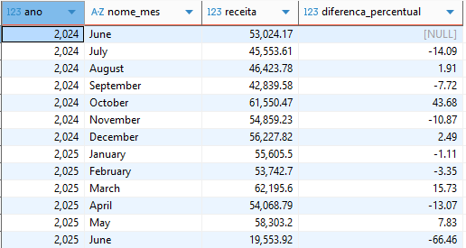
        
        A base de dados contém dados de um ano de funcionamento da EcoViagens, portanto, ainda não é possível fazer considerações sobre variações sazonais. 
        
        De forma geral, a variação de receita em relação ao mês anterior é instável, com 6 meses de queda dentre os analisados. Dessa forma, devem ser avaliadas ações para aumentar a previsibilidade e segurança do negócio, como mapeamento da sazonalidade, criação de promoções e pacotes exclusivos para meses de baixa demanda, e realização de análises preditivas com base em dados históricos (quando estiverem disponíveis) para prever quedas de receita e planejar ações de forma antecipada.
        
        O mês de março/2025 apresentou a maior receita dentre os meses analisados. Recomenda-se investigar o que se passou naquele mês para obtermos esse número: Qual estratégia adotamos? Ela pode ser replicada em outros meses? Fizemos algo diferente? Ainda, quando tivermos mais dados disponíveis, poderemos verificar se é uma característica sazonal daquele mês.
        
    - **Valor médio gasto por pessoa:**
        
        Objetivo: Identificar se os clientes estão investindo mais em experiências premium ou optando por opções econômicas.
        
        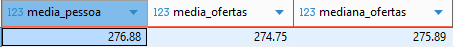
        
        A análise do valor médio gasto por pessoa permitiu a comparação com o preço de venda médio de cada oferta para identificar se a preferência dos clientes era por alternativas mais econômicas ou experiências premium.
        
        O valor médio gasto por pessoa é muito próximo da média e mediana do preço médio de venda. Isso indica que, em média, os clientes consomem experiências alinhadas ao valor típico das ofertas disponíveis no portfólio da empresa, sem preferências claras por ofertas premium ou econômicas.
        
    - **Distribuição de reservas por tipo de oferta:**
        
        Objetivo: Saber qual tipo de oferta é mais popular para orientar a divulgação dessas experiências no site da EcoViagens.
        
        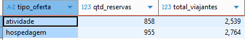
        
        A popularidade é ligeiramente maior para hospedagens. A popularidade relativamente equilibrada mostra que ambos os tipos de oferta são relevantes para os usuários. Portanto, recomenda-se que tanto ofertas de hospedagem quanto de atividades sejam promovidas no site da EcoViagens, com possível destaque para hospedagens.
        
    - **Taxa de repetição de clientes (fidelização):**
        
        Objetivo: Medir o engajamento, satisfação e fidelização com as experiências oferecidas.
        
        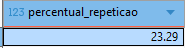
        
        A taxa de fidelização indicou que quase 1/4 da base de clientes retorna para novas experiências na EcoViagens. O número não é elevado e há espaço para crescimento e aumento do LTV por meio de estratégias como: implementação de programas de fidelidade, descontos progressivos e benefícios exclusivos para clientes recorrentes; monitoramento da taxa para verificar o impacto de melhorias na experiência do usuário e campanhas de marketing; comparar o perfil dos clientes recorrentes e únicos para identificar possíveis diferenças e oportunidades de melhoria.
        
    - **Avaliação média das ofertas:**
        
        Objetivo: Identificar as ofertas com o melhor desempenho percebido pelo cliente.
        
        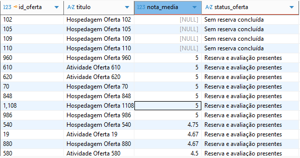
        
        Notas de avaliação maiores mostram que a oferta está satisfazendo mais os clientes e possui maior valor percebido. Portanto, ofertas mais bem avaliadas podem ser destacadas no site para atrair mais usuários e potencializar conversões. Além disso, ofertas mal avaliadas devem receber atenção do time operacional para identificar motivos das notas baixas e promover ações de melhoria.
        
    - **Índice de adoção de práticas sustentáveis:**
        
        Objetivo: Garantir que as ofertas estejam atreladas aos valores da marca (impacto ambiental positivo).
        
        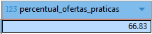
        
        O índice de práticas sustentáveis está abaixo da meta da empresa (90%). Um índice elevado é fundamental para refletir o compromisso e propósito da EcoViagens com o turismo sustentável. Recomenda-se o monitoramento contínuo para identificar a necessidade de ações educativas ou de incentivo a adoção de práticas sustentáveis.
        
    - **Práticas sustentáveis mais populares:**
        
        Objetivo: Identificar quais práticas sustentáveis são mais valorizadas e têm maior impacto no posicionamento e narrativa da EcoViagens.
        
        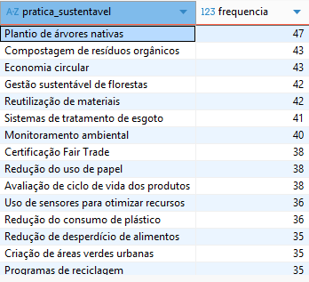
        
        A listagem de práticas sustentáveis mais populares pode ser usada pelo time de marketing na criação de material educativo para incentivar a adoção dessas práticas pelos nossos parceiros. Além disso, pode ser usada para destaque das práticas mais valorizadas nos canais de comunicação.
        
    - **Tempo médio entre reservas dos clientes recorrentes:**
        
        Objetivo: Auxiliar na criação de campanhas de reengajamento no momento ideal e evitar churn.
        
        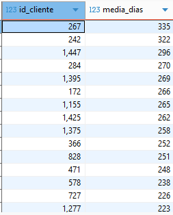
        
        Esse indicador pode ser usada pelo time de CRM para identificação do momento certo de realizar campanhas de reengajamento, aumentando a eficiência das ações e diminuindo o churn.
        
    - **Desempenho médio dos operadores por categoria de oferta:**
        
        Objetivo: Premiar os melhores parceiros e oferecer treinamento aos demais.
        
        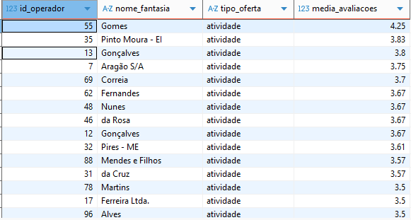
        
        A listagem obtida pode ser usada pelo time de operações em premiações aos melhores operadores e direcionamento de treinamentos aos mais mal avaliados. 
        
4. **Dashboards de acompanhamento do desempenho do negócio**
    
    Nessa etapa foram elaborados cinco dashboards de monitoramento por meio de conexão direta do Power BI com os dados no PostgreSQL. Eles podem ser vistos neste [relatório em Power BI](https://app.powerbi.com/view?r=eyJrIjoiYjAwMzUxOGQtYzgxMS00NDU3LTk1M2QtYjY4YTUxYmUyMTY0IiwidCI6ImUyZjc3ZDAwLTAxNjMtNGNmNi05MmIwLTQ4NGJhZmY5ZGY3ZCJ9). Além disso, as métricas apresentadas nos dashboards foram verificadas e validadas por meio de consultas SQL para garantir a consistência das informações apresentadas [Script validação SQL](sql_scrips/validacao_bi.sql).
    
    - **Visão Operação:**
        
        Objetivo: Monitorar a saúde do negócio, ou seja, o desempenho financeiro e de mercado.
        
        As métricas financeiras monitoram como está a tendência de receita mensal da empresa, permitindo verificar efeitos de sazonalidade e o impacto de promoções ou ações específicas no crescimento mensal.
        
        O acompanhamento mensal das avaliações contribui para o entendimento da qualidade percebida pelo cliente, permitindo a identificação de quedas significativas na avaliação da qualidade das ofertas. Além disso, o acompanhamento do percentual de reservas concluídas com avaliação permite entender se estamos tendo avaliações o suficiente para que as métricas de avaliação realmente reflitam a opinião de parcela significativa dos clientes; mostra também o engajamento dos clientes em avaliar suas experiências.
        
        O acompanhamento do percentual de cancelamento permite identificar se há tendências de aumento significativo nessa taxa e se é necessário investigar motivos para os clientes estarem cancelando, como insatisfação com a qualidade dos serviços ou problemas operacionais.
        
        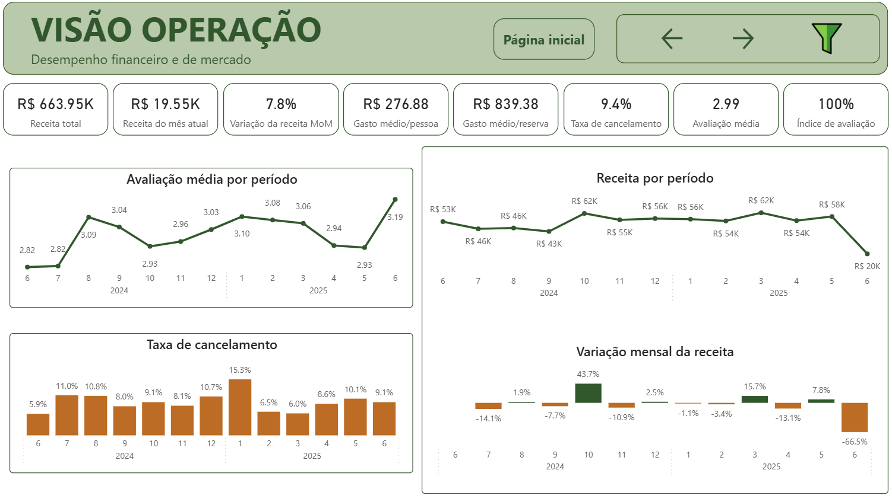
        
    - **Visão Clientes:**
        
        Objetivo: Monitorar a fidelização e identificar o perfil dos clientes.
        
        O acompanhamento da taxa de fidelização permite verificar se há diferença no ticket médio dos clientes recorrentes em relação aos clientes únicos e qual tipo de oferta gera maior fidelização.
        
        A caracterização do perfil do cliente permite segmentar ações por gênero e idade.
        
        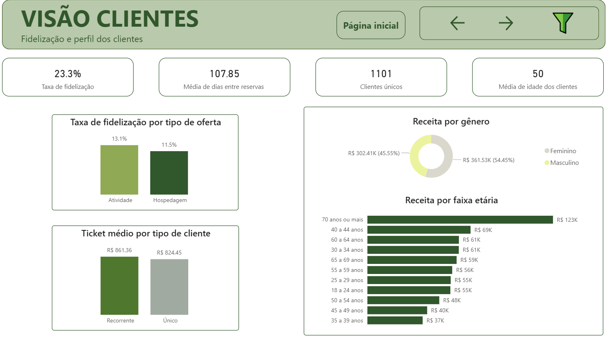
        
    - **Visão Ofertas:**
        
        Objetivo: Monitorar o desempenho financeiro, as avaliações e popularidade das ofertas.
        
        O acompanhamento da taxa de ofertas sem reservas concluídas permite verificar o percentual de ofertas ociosas/não-atrativas aos clientes e se o percentual está alto o suficiente para justificar medidas de intervenção ou investigação de motivos.
        
        O preço médio das ofertas pode ser comparado ao gasto médio por pessoa para entender o perfil de consumo dos clientes.
        
        O acompanhamento da quantidade de reservas por período segmentado por tipo de oferta permite acompanhar a popularidade dos tipos de oferta e se há variações ao longo do tempo.
        
        O impacto do gasto médio mensal por reserva (ticket médio) é avaliado por mês e tipo de oferta, permitindo identificar se há crescimento ao longo do tempo e qual tipo de oferta contribui mais para o ticket médio. Permite também identificar se existe relação entre popularidade e rentabilidade.
        
        O acompanhamento da nota média, receita e quantidade de reservas por tipo de oferta permite verificar se as ofertas mais bem avaliadas são também as mais rentáveis e populares. Além disso, o detalhamento por oferta permite identificar ofertas específicas com as melhores e piores performances, orientando ações de melhoria das ofertas de baixa performance e possibilitando verificar o que as melhores ofertas têm em comum.
        
        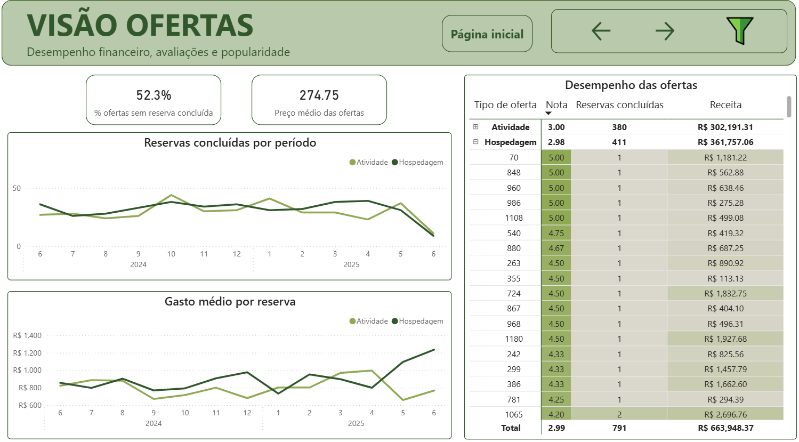
        
    - **Visão Operadores:**
        
        Objetivo: Monitorar o desempenho financeiro, popularidade e avaliações dos operadores.
        
        O acompanhamento da popularidade, receita e avaliação dos operadores permite identificar se boas avaliações refletem em maior popularidade e receita. Além disso, a visão detalhada por operador identifica operadores com melhor e pior desempenho, permitindo o direcionamento de ações como premiações aos melhores e treinamento aos mais mal avaliados.
        
        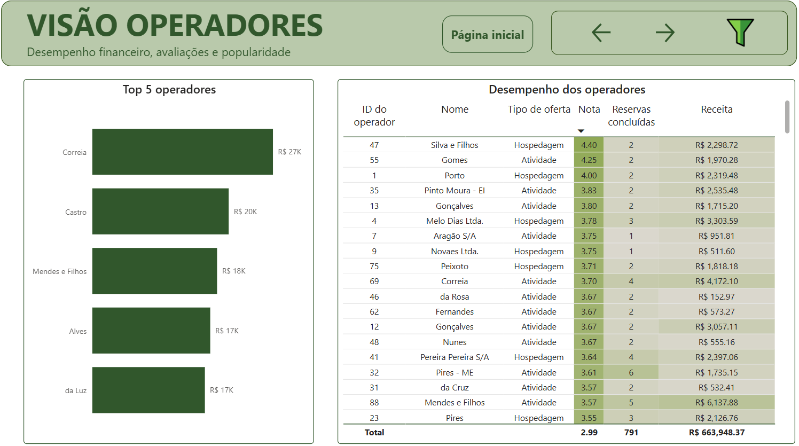
        
    - **Visão Sustentabilidade:**
        
         Objetivo: Monitorar o impacto das práticas sustentáveis no negócio, ou seja, no desempenho das ofertas (avaliação e receita).
        
        O acompanhamento do percentual de adoção de práticas sustentáveis permite verificar se estamos próximos da meta da organização e se estamos alinhados com a cultura e proposta da empresa. Além disso, o acompanhamento por tipo de oferta verifica se há relação entre a adoção de práticas sustentáveis e o tipo de oferta.
        
        O acompanhamento da popularidade das práticas sustentáveis e suas avaliações permite verificar se notas mais altas refletem em maior número de reservas.
        
        A visão detalhada por oferta permite identificar as ofertas que oferecem mais práticas sustentáveis e aquelas que não estão alinhadas ao propósito do negócio (não oferecem nenhuma prática sustentável). Além disso, permite verificar se há relação entre a quantidade de práticas sustentáveis oferecidas e o preço da oferta, sua nota de avaliação, a quantidade de reservas e a receita.
        
        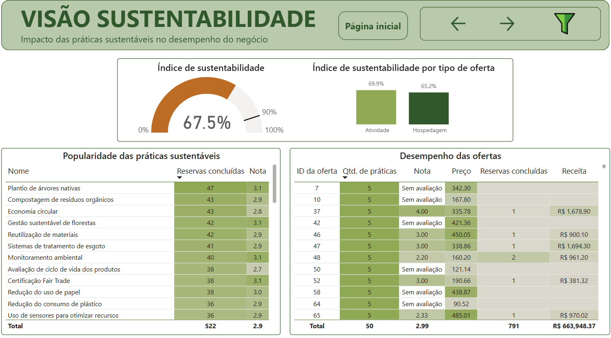
        

### 5. O produto final do projeto

Conforme descrito anteriormente, as principais entregas do projeto foram:

- O modelo de entidade relacionamento para o banco de dados.
- O [script Python](src/pipeline.py) para automação da carga de dados no banco de dados.
- A proposta de KPIs a serem monitorados.
- O [script SQL](sql_scrips/perguntas_negocio.sql) com as respostas às perguntas de negócio.
- Um [relatório em Power BI](https://app.powerbi.com/view?r=eyJrIjoiYjAwMzUxOGQtYzgxMS00NDU3LTk1M2QtYjY4YTUxYmUyMTY0IiwidCI6ImUyZjc3ZDAwLTAxNjMtNGNmNi05MmIwLTQ4NGJhZmY5ZGY3ZCJ9) para acompanhamento dos KPIs.
- Uma [apresentação executiva](https://www.canva.com/design/DAHBt1sDoSc/tuKTbycc5F7xqb_LT2LkGQ/edit?utm_content=DAHBt1sDoSc&utm_campaign=designshare&utm_medium=link2&utm_source=sharebutton) contendo os principais insights e recomendações obtidos com base na análise dos dados.

### 6. Principais insights de dados

- **A receita tem comportamento instável, apresentando 6 meses de queda durante o período de 12 meses analisados:**
    
    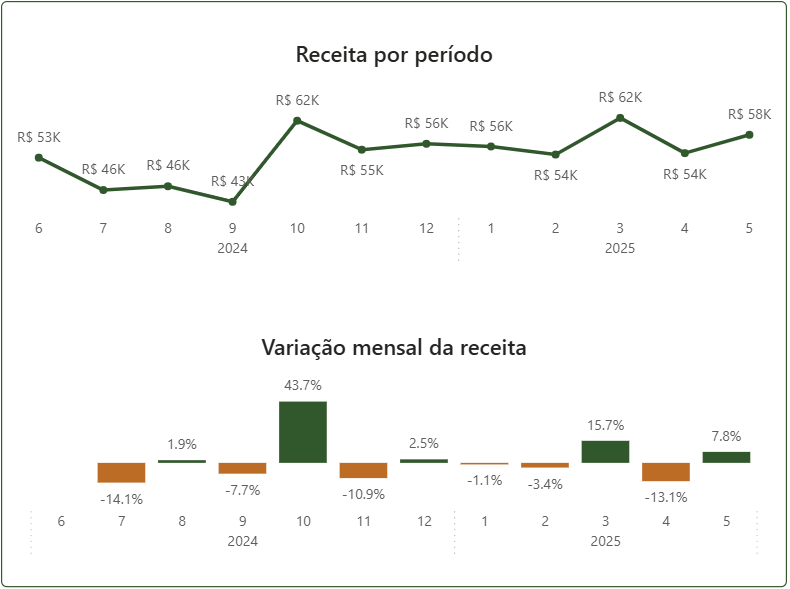
    
    Não há tendência de crescimento contínuo. Em alguns meses observa-se quedas de até 14% em relação ao mês anterior.
    
    Esse comportamento é um indicativo de incerteza financeira e da necessidade de ações para aumentar a previsibilidade e segurança do negócio.
    
    Para estabilizar a receita, é necessário mapear a sazonalidade e realizar campanhas específicas para aumentar a procura por reservas nos meses de baixa. Sugere-se:
    
    - A curto prazo: promoções e pacotes exclusivos para os meses de baixa demanda.
    - A longo prazo: análise preditiva com base em dados históricos para prever quedas na receita e planejar ações antecipadamente.

- **A taxa geral de fidelização é baixa (23%). No cenário anual, a taxa caiu de 15,5% em 2024 para 11,2% em 2025:**
    
    2024:
    
    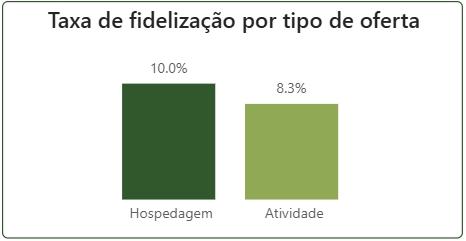
    
    2025:
    
    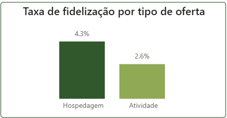
    
    Quando segregamos por tipo de atividade, observa-se uma fidelização maior em ofertas do tipo “hospedagem”. No entanto, a taxa de fidelização dos clientes é baixa, ou seja, os clientes não estão percebendo valor suficiente para retornar.
    
    Esse comportamento implica em maiores gastos com aquisição de novos clientes e indica a necessidade de ações de fidelização por meio do aumento do valor percebido.
    
    Para aumentar a retenção de clientes e o LTV, é necessário incentivar o retorno por meio de programas e recompensas específicos e aumentar a percepção de valor em retornar. Sugere-se:
    
    - Programas de descontos progressivos para clientes recorrentes.
    - Envio automático de ofertas de descontos para novas reservas.
    - Revisão do posicionamento das “atividades”, pois possuem menor taxa de fidelização em relação às “hospedagens” e criar pacotes integrados de hospedagem e atividade.

- **A diferença entre o ticket médio dos clientes recorrentes (R$ 853,50) e dos clientes únicos (R$ 823,69) é pequena (apenas R$ 29,81):**
    
    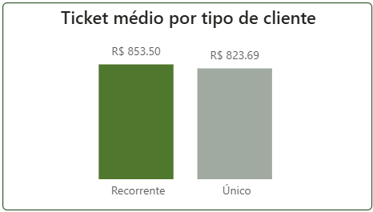
    
    A diferença entre o ticket médio dos clientes recorrentes e dos clientes únicos é praticamente insignificante. Isso mostra que não estamos tendo retorno financeiro ao fidelizar clientes.
    
    Esse comportamento sinaliza a necessidade não apenas de ações de fidelização, mas medidas que façam com que os clientes recorrentes queiram gastar mais na EcoViagens.
    
    Para aumentar o ticket médio dos clientes recorrentes, é necessário promover o aumento do valor gasto por meio de estratégias de upsell e cross-sell. Sugere-se:
    
    - Oferta de pacotes complementares no ato da reserva, como transporte, seguro viagem e alimentação.
    - Oferta de pacotes premium ou personalizados.
    - Estímulo à compra de pacotes em grupo ou família.
    
- **Um maior número de práticas sustentáveis não gera maior receita. Ofertas com poucas ou nenhuma prática sustentável apresentam os melhores resultados financeiros:**
    
    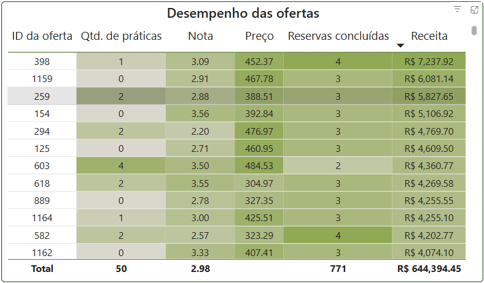
    
    A quantidade de práticas sustentáveis oferecidas não reflete em aumento de receita. O que indica que os clientes não estão vendo valor na proposta de sustentabilidade.
    
    Esses resultados indicam que a sustentabilidade não influencia a decisão de compra, sendo necessárias ações que a transformem em valor percebido.
    
    Para aumentar o valor percebido das práticas sustentáveis, é necessário traduzi-las em valor tangível para o cliente e integrá-las às suas experiências. Sugere-se:
    
    - Apresentação quantitativa do impacto positivo da prática de forma visível no site (por exemplo: “Esta viagem reduz emissões de CO2 em X kg”).
    - Integração das práticas sustentáveis ao roteiro da viagem por meio de storytelling durante a estadia e relatórios pós-viagem quantificando o impacto gerado.
    - Destaque no site para as ofertas com maior impacto sustentável.

Os insights apresentados também foram descritos em uma [apresentação executiva](https://www.canva.com/design/DAHBt1sDoSc/tuKTbycc5F7xqb_LT2LkGQ/edit?utm_content=DAHBt1sDoSc&utm_campaign=designshare&utm_medium=link2&utm_source=sharebutton).

### 7. Conclusão

Esse projeto realizou a modelagem de dados de uma plataforma de turismo sustentável, automatizou a carga dos dados no banco de dados com Python, sugeriu KPIs para acompanhar o desempenho do negócio e orientar as áreas de negócio, analisou dados com SQL para obter insights, gerou dashboards no Power BI para visualização e acompanhamento dos dados e resumiu os principais achados em uma apresentação executiva.

Cada etapa do projeto contribuiu para que a EcoViagens possua controle das decisões tomadas no negócio por meio de uma gestão baseada em dados confiáveis. Os insights obtidos por meio da análise dos dados permitem que a empresa:

- Identifique gargalos na operação e ajuste processos para melhorar a experiência do usuário.
- Implemente programas de melhorias, capacitação e suporte aos operadores locais.
- Antecipe demandas e personalize ofertas para para maximizar a receita.

### 8. Próximos passos

As sugestões propostas nesse projeto abordaram os principais aspectos para melhorar o desempenho da EcoViagens. Além deles, outros insights que podem ser utilizados pelas equipes de negócio da empresa são: 

- A análise realizada do perfil dos clientes (gastos por idade, gênero) verificou que as mulheres e pessoas com 70 anos ou mais geraram maior receita para a empresa, essa informação pode auxiliar no direcionamento de campanhas.
- A análise da taxa de cancelamento verificou que ela variou entre 6 e 15% ao longo do período de análise. Essa informação pode ser usada para investigação de problemas operacionais e de satisfação dos clientes.

### 9. Referências

- Os dados utilizados nesse projeto foram retirados do EBA: https://renatabiaggi.com/eba-analista/
- A imagem de capa do dashboard e do portfólio foi retirada do Storyset: https://storyset.com/
- Os ícones de filtro e borracha usados nos dashboards foram retirados de: https://www.flaticon.com/